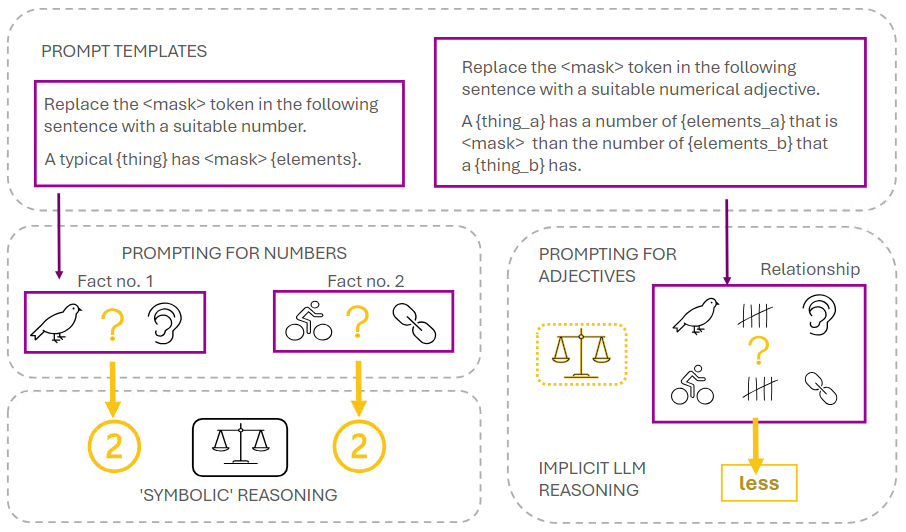

# ear-probing
Code for Entailed Arithmetical Probing of LLMs

## Quick summary
Code base to accompany the NeSy paper 'Can Large Language Models put 2 and 2 together? Probing for Entailed Arithmetical Relationships', which investigates the intersection of knowledge retrieval and reasoning of LLMs. 

Broad strokes overview of what it's about:

## WIP!
I have done unspeakable things to the code base to meet deadlines. Please bear with for a wee while longer... 
(29.06.2024)

## Repository structure

Draft at the moment, add / review - not yet sure how things will interact?

* * *
    ear-probing
    │ 
    ├── data                      --> data, both in / out   
    │   │   
    │   ├── entailment            --> entailment data stored as objects
    │   │   
    │   ├── figures               --> figures for the EAR paper
    │   │   
    │   └── probes                --> making sure no data is stored on git, just the folder
    │
    ├── notebooks                 --> notebooks for interactive dev (or demos)
    │   │   
    │   └── ab-0-0-name           --> e.g. initials, number, descriptive name
    │ 
    ├── ear                       --> code base
    │   │   
    │   ├── chat_api.py           --> wrappers for models (needs a clean)
    │   │   
    │   ├── entail.py             --> 'probator' objects either for API or using pipelines
    │   │   
    │   ├── evaluate.py           --> somve tools for evaluation (needs a clean)
    │   │   
    │   ├── prompt_parsing.py     --> well, actually LLM answer parsing but technically also 1 prompt parsing util
    │   │   
    │   ├── prompt_selection.py   --> well, actually LLM answer parsing but technically also 1 prompt parsing util
    │   │
    │   ├── utilities.py          --> shared utilities, e.g. log formatting
    │   │   
    │   └── __init__.py
    │
    ├── (requirements.txt)     --> TBA
    │
    ├── README.md
    │ 
    └── .gitignore             --> customarily ignoring data, but keeping the probes, entailment and figures for paper
* * *